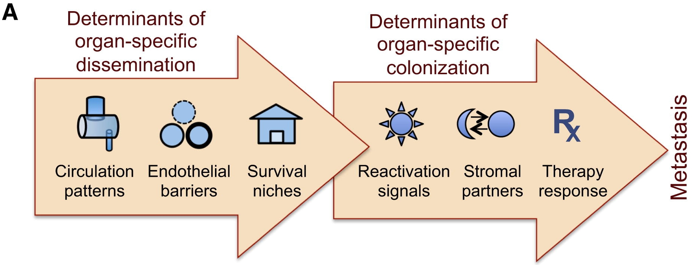
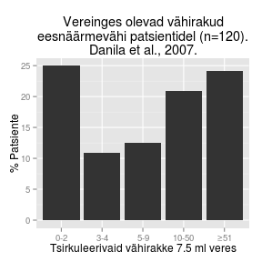
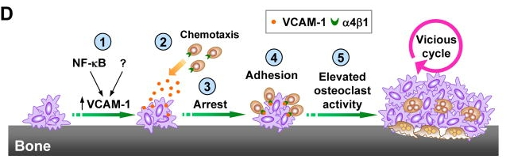
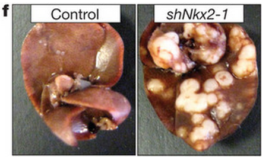
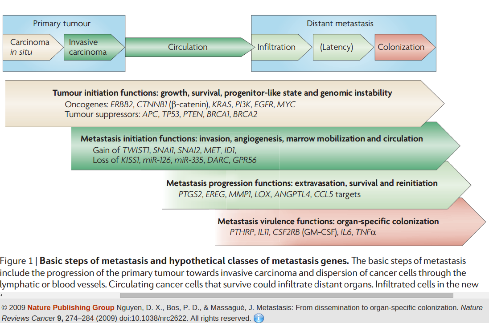

<!-- Limit image width and height -->

<!-- Center image on slide -->

<!-- Italic and Bold -->

--- .segue .dark .nobackground

## Recap

---- &twocol

## Vähi mikrokeskkond

Kasvajarakud ümbritseb kompleksne mikrokeskkond, mis koosneb:

***=left

- normaalsetest rakkudest,
- sekreteeritud valkudest,
- füsioloogilistest madalmolekulaarsetest ühenditest (hormoonid),
- veresoontest.

***=right

<footer class="source">Pilt: Nature.com
</footer>

---

## Heterotüüpne ligand-retseptor signalisatsioon

- Erinevate rakutüüpide vahelist signaliseerimist nimetatakse **heterotüüpseks signalisatsiooniks**.
- Heterotüüpne signalisatsioon soodustab või pidurdab kõrvalolevate teiste rakutüüpide jagunemist ja/või ellujäämist.

<footer class="source">Pilt: Retsiprookne PDGF-A ja PDGFR-a ekpsressioon testistes. PDGF-A-d ekspresseerivad tubulaarse epiteeli rakud ja PDGF-R ekspresseerivad mesenhümaalsed rakud. 
<a href="http://jcb.rupress.org/content/149/5/1019.full"> Gnessi et al., 2000.
</a>
</footer>

---

## Epiteliaal-mesenhümaalne transformatsioon (EMT)

- EMT on kartsinoomirakus transientne protsess mille käigus: 
    - epiteelirakud kaotavad polaarsuse, 
    - lõhustuvad rakkude vahelised adhesioonid ja 
    - rakud omandavad amööbse liikumise ja invasiivse võime.
- Vähi metastaaside teke on seotud EMT-ga.
- EMT-ga on seotud TGF-$\beta$ indutseeritavad transkriptsioonifaktorid **Twist, Snail, Slug ja ZEB**.

--- .segue .dark .nobackground

## Metastaasid

---

<q> Vähi kollete levimine algsest primaarsest paikmest keha teistesse osadesse. Selliseid sekundaarseid vähikoldeid nimetatakse <b>vähi siireteks ehk metastaasideks</b>. Vähi siire koosneb rakkudest mis on sarnased vähirakkudele algses paikmes.</q>

---

## Vähk on evolutsiooniline protsess

---

## Metastaaside klonaalse selektsiooni mudel

- Tegemist on nö. "Darwinliku selektsiooni" protsessiga. 
- Klassikalise klonaalse selektsiooni mudeli kohaselt moodustavad metastaase **algses vähis asuvad minoorsed rakud**.
- Selline haruldane rakukloon selekteeritakse sekundaarses paikmes ja ta suudab ekspandeeruda/kasvada.
- **Eksisteerivad spetsiifilised metastaasi mutatsioonid/geenid**.

<footer class="source">Pilt:  Isaiah J. Fidler and Margaret L. Kripke, 
<a href="http://162.105.160.3/main/2011course/class%202/Fidler%20Kripke%201977.pdf">1977
</a>
</footer>

---&twocol

## Alternatiivne mudel
# Metastaasi potentsiaal on suuremas osas algses vähimassis olemas

- Vähi metastaseerumise ennustab algse vähimassi geeniekspressioon.

***=left

- Rinnavähi halva prognoosi geenimuster *'poor prognosis' signature*. 
- Halva prognoosi geenimuster sisaldab geene mis reguleerivad rakutsüklit, invasiooni ja angiogeneesi.
- **Metastaseerumise põhjustavad samad onkogeensed stiimulid/geenid, mis põhjustasid ka algse vähi tekke**.

***=right

<footer class="source">Pilt:  Gene expression profiling predicts clinical outcome of breast cancer. 
<a href="http://www.nature.com/nature/journal/v415/n6871/full/415530a.html">van 't Veer et al., 2002.
</a>
</footer>

---

<header>

</header>

## Metastaseerumise protsess
# Kliiniliselt detekteeritava metastaasi tekkeks peab toimuma terve rida juhuslikke sündmusi

- Metastaseerumise käigus peavad vähirakud kõigepealt organismis laiali kanduma ja  uutes asukohtades ellu jääma ning hiljem suutma jaguneda et moodustuks sekundaarne vähk. 
- Protsess sisaldab 
    - vähirakkude migreerumist, 
    - lokaalset ivasiooni, 
    - sisenemist vereringesse, 
    - arresteerumist sekundaarses koes ja veresoonest väljumist ning 
    - lõpuks uue koloonia moodustamist.
- Koloniseerumine omakorda eeldab mitmeid samme, nagu vähirakkude ellujäämist, mikrometastaaside moodustumist, pikaajalise latentsusperioodi üleelamine ja kasvu reaktiveerimine.

---

## Metastaasi etapid

<footer class="source">Pilt: Metastasis Steps and Bottlenecks. Sakari Vanharanta, Joan Massagué, 
<a href="http://www.cell.com/cancer-cell/fulltext/S1535-6108(13)00417-0">2013
</a>
</footer>

---

# Tsütokeratiin positiivsed rinnavähi mikrometastaasid regionaalses lümfisõlmes.

<footer class="source">Pilt: 
<a href="http://ajcp.ascpjournals.org/content/121/5/637.long">
Ouellette et al., 2004.
</a>
</footer>

---&twocol

## Metastaaside organotropismi määravad faktorid

***=left

- Organ-spetsiifilist levikut määravad faktorid.
    - Vereringe muster.
    - Endoteeli omadused.
    - Ellujäämis niššid.

***=right

- Organ-spetsiifilist kolonisatsiooni määravad faktorid.
    - Latentsus ja reaktivatsioonisignaalid.
    - Stroomarakkude signalisatsioon.
    - Teraapia vastus.
    
<footer class="source">Pilt: Metastasis Steps and Bottlenecks. Sakari Vanharanta, Joan Massagué, 
<a href="http://www.cell.com/cancer-cell/fulltext/S1535-6108(13)00417-0">2013
</a>
</footer>

---&twocol

## Metastaasi ebaefektiivsus

***=left

- Tuumorist lahkub vereringesse igapäevaselt tuhandeid vähirakke.
- Kliinilise metastaasi moodustavad ainult väga väikene osa vereringesse sisenenud vähirakke.

***=right

 

<footer class="source">Pildi andmed: 
<a href="http://clincancerres.aacrjournals.org/content/13/23/7053.full">
Danila et al., 2007.
</a>
</footer>

---&twocol

## Kolonisatsioon on metastaseeruvate vähirakkude peamine pudelikael

***=left

- Suur osa sekundaarsesse koesse jõudnud vähirakkudest ei jagune ja jäävad dormantsesse seisundisse.

***=right

<footer class="source">Pilt: 
<a href="http://www.ncbi.nlm.nih.gov/pmc/articles/PMC1853000/">
Luzzi et al., 1998.
</a>
</footer>

---&twocol

## *Seed and soil* hüpotees
# Komplementaarne kahe eelneva mudeliga

***=left

***=right

- 1889. a. pakkus Inglise kirurg Stephen Paget välja nn. *seed and soil* hüpoteesi, mis tänapäevaselt tähendab, et **vähirakud annavad metastaasi kui nad satuvad sobivasse koe mikrokeskkonda**.

---

## Metastaasigeenid
# Primaarses kasvajas ekspresseeritavad metastaasigeenid annavad vähile

- **lokaalse kasvueelise**: EREG (epiregulin) ja COX2/PTGS2 ekspressioon stimuleerib angiogeneesi. Kollageeni krosslinkivat aktiivsust omav LOX (lüsüül oksüdaas) indutseerib vähirakkude migratsiooni ja angiogeneesi;
- **distaalse eelise** mingisse kindlasse organisse infiltreerumiseks: hüpoksia ja TGF-$\beta$ indutseeritud ANGPL4 indutseerib veresoonte läbilaskvuse ja võimaldab siseneda distaalsesse koesse.

<footer class="source">Pilt: Metastasis: From dissemination to organ-specific colonization.
<a href="http://www.nature.com/scitable/content/metastasis-from-dissemination-to-organ-specific-colonization-14019153">
Don X. Nguyen, Paula D. Bos and Joan Massagué, 2009.
</a>.
</footer>

---

## Vähirakkude sisenemist vereringesse vahendavad makrofaagid

- Perivaskulaarsed makrofaagid loovad vähis metastaatilise mikrokeskonna (*tumor microenvironment of metastasis*).
- **Vähirakkude ja makrofaagide vahel toimub EGF/CSF-1 parakriinne signalisatsioon**.
- Vähirakkude poolt sekreteeritav CSF-1 indutseerib vähi makrofaagidel EGF-i ekspressiooni, mis positiivse tagasisidena omakorda indutseerib vähirakkudel veelgi CSF-1 ekspressiooni.

<footer class="source">Pilt: Hernandez et al., 
<a href="http://cancerres.aacrjournals.org/content/69/7/3221.long">
2009
</a>.
</footer>

---

## Vähirakkude intravaseerumine

<video width="640" height="390" 
src="assets/img/movie.mp4#t=45" 
controls>
</video>

<footer class="source">Video: www.metastat.com
</footer>

---&twocol

## Metastaasi mustrid: organid

***=left

- Kasvajad mis annavad metastaase peamiselt ühte organisse:
    - eesnäärmevähid luudesse;
    - silma melanoom maksa;
    - sarkoomid kopsu.
- Erinevatesse organitesse metastaseeruvad:
    - kolmik-negatiivsed rinnavähid;
    - naha melanoomid;
    - kopsuvähid;
    - neeruvähid.

***=right

<footer class="source">Pilt: wikipedia
</footer>

---

## Tüüpilised tahkete kasvajate metastaasikohad

Vähitüüp | Põhilised metastaasi kohad
------------|--------------------------------
Rind | luu, kopsud, maks ja aju
Kopsu adenokartsinoom | aju, luud, neerupealsed ja maks
Naha melanoom | kopsud, aju, nahk, maks
Käärsool | maks ja kopsud
Kõhunääre | maks ja kopsud
Eesnääre | luud
Sarkoom | kopsud
Silma melanoom | maks

<footer class="source">Tabel: Metastasis: From dissemination to organ-specific colonization.
<a href="http://www.nature.com/scitable/content/metastasis-from-dissemination-to-organ-specific-colonization-14019153">
Don X. Nguyen, Paula D. Bos and Joan Massagué, 2009.
</a>.
</footer>

--- &twocol

## Metastaasi muster: vereringe

***=left

***=right

- Kõige esimene organ kuhu südamest välja pumbatav veri jõuab on kopsud.
- Luuüdis ja maksas olev fenestreeritud endoteel on vähirakkudele vereringest väljumiseks permissiivsem kui muudes organites.
- Kopsu endoteel on suhteliselt raskemini läbitav ja 
- kesknärvisüsteemis olev BBB on kõige tugevam barjäär.
- Ometigi umbes 30% metastaatilistest rinnavähkidest annavad ajumetastaase.

<footer class="source">Pilt: http://www.uic.edu/classes/bios/bios100/lecturesf04am/lect20.htm
</footer>

---&twocol

## Metastaasi muster: vereringe

***=right

- Vereringe määrab **soolekasvajate peamise metastaaside sihtpaigana maksa**,
    - 80% soolevähi korduv patsentidest on maksametastaasid. 
- Maksametastaasid on eelkõige tingitud sellest, et **soolestikust lähtuv portaalveen suubub maksa** ja **maksa endoteel on fenestreeritud**.

***=left

<footer class="source">Pilt: liver sinusoidal endothelial cell fenestrations.
<a href="http://www.ncbi.nlm.nih.gov/pmc/articles/PMC3043550/">
Cogger et al., 2010.
</a>.
</footer>

---

## Metastaatiline latentsus
# Kliiniliselt on see periood, mis jääb vähi avastamise ja detekteeritavate metastaaside tekke vahele

- Raku tasemel väljendub latentsus 
    - vähiraku jagunemise arrestis ja vaikeolekus (dormantsus);
    - mitteproduktiivses jagunemises, kus jagunemine on balanseeritud apoptoosi poolt;
    - tüvirakuliste omaduste kadumine (*loss of stem cell fitness/stemness*).

---

# Metastaatilise latentsuse kadu: VCAM-1 vahendatud osteoklastide värbamine

- Rinnavähi mudelis on leitud, et sellisest dormantsusest väljunud luu mikrometastaasid on hakanud ekspresseerima enda pinnal VCAM-1 molekuli [Lu et al., 2011](http://www.ncbi.nlm.nih.gov/pmc/articles/PMC3241854/).
- VCAM-1 ekspressioon värbab dormantse vähiraku juurde $\alpha 4 \beta 1$ integriine ekspresseerivad monotsüüdid, mis diferentseeruvad luud lagundavateks osteoklastideks. VCAM-1 on $\alpha 4 \beta 1$ integriini ligand mille kaudu lümfotsüüdid arresteeruvad veresoone pinnal.
- Osteoklastide aktiveerumisega vabaneb luu maatriksist rohkelt kasvufaktoreid tekib nö. nõiaring (*vicious cycle*).

---

# Metastaatilise latentsuse kadu: sekundaarse koe strooma rakud sekreteerivad tüvirakulisust supresseerivat faktorit

- Rinnavähi kopsumetastaasid hakkavad sekreteerima tüvirakulisust pärssiva TGF-$\beta$ perekonna ligandi **BMP4** blokeerivat faktorit **Coco** [Gao et al., 2012](http://www.sciencedirect.com/science/article/pii/S0092867412008720).
- Coco ekspressioon neutraliseerib parakriinse BMP ja võimaldab vähirakkude reaktivatsiooni.

---

## Kliiniline metastaasi muster on eri patsientidel ja vähitüüpidel erinev

- Glioblastoomid metastaseeruvad harva.
- Medulloblastoomid metastaseeruvad sagedasti.
- Kopsu- ja kühunäärme kartsinoomid on sagedasti metastaseerunud juba esmasdiagnoosil.
- Rinna- ja eesnäärmevähid reeglina diagnoosimisel metastaseerunud ei ole.
- Umbes 10% patsentidel esineb vähke mille algne paige on määramatu (*cancer of unknown primary origin*, *CUP*).

---&twocol

## Metastaaside temporaalne muster

Kliiniliselt on raske määrata, kui kiiresti konkreetne vähk progresseerub primaarsest kasvajast latentsete siirete tekkeni ja sealt nähtavate metastaasideni.

***=left

- Kõhunäärmekasvajad arvati metastaseeruvat progressiooni varases staadiumis, kuid eksoomi sekveneerimine ja matemaatiline modelleerimine viitab pigem, et kõhunäärmekasvajad pigem avastatakse liiga hilja.
- Rinna ja eesnäärmevähkide puhul tekivad metastaasid vähi arengus vara ja püsivad kaua latentsed.

***=right
T1: aeg mis kulub pankrease intraepiteliaalse neoplaasia tekkeks (PanIN). PanIN on ivasiivse vähi eellane. Tavaline vanemaealises populatsioonis. 

<footer class="source">Pilt: Distant metastasis occurs late during the genetic evolution of pancreatic cancer.
<a href="http://www.nature.com/nature/journal/v467/n7319/full/nature09515.html">
Yachida et al., 2010.
</a>.
</footer>

---

## Veresoontest väljumine
# Veresoontest väljumist soodustavate geenide ekspressioon suurendab vähirakkude laiali kandumist kudedesse ja seega koloniseerimise tõenäosust.

- Rinnavähi aju metastaase näiteks vahendavad COX2, HB-EGF ja ST6GALNAC5 (*α2,6-sialyltransferase*) ([Bos et al., 2009](http://www.nature.com/nature/journal/v459/n7249/full/nature08021.html)).
- COX2 ja HB-EGF-EGFR ekspressioon annab vähirakule "võimenduse" mitte fenestreeritud endoteeli läbimiseks ja ajukoe koloniseerimiseks.
- $\alpha$2,6-sialüültransferaasi ekspressioon põhjustab sialüül-epitoopide ekspressiooni vähiraku pinnal ja võimaldab aju-spetsiifilist infiltratsiooni.

--- 

# Heterotroopsetel interaktsioonidel on oluline roll metastaatilisel koloniseerimisel

- Rinnavähi osteolüütilised metastaasid, kus toimub luukude lagundavate osteoklastide aktivatsioon. Vabaneb terve rida maatriksisse deponeeritud kasvufaktoreid.
    - Vähirakud sekreteerivad paratüroidhormoon peptiidi (PTHrP) ja mõjutavad seeläbi osteoblaste (luukude ülesehitavad rakud) sekreteerima RANKL ja mitte sekreteerima RANKL *decoy* retseptorit OPG (osteoprotegerin), mis stimuleerib osteoblaste.
- Rinnavähi ajumetastaasid ekspresseerivad IL1$\beta$, mis aktiveerib astrotsüüdid. Aktiveeritud astrotsüüdid hakkavad ekspresseerima NOTCH ligandi JAGGED, mis stimuleerib omakorda vähirakke ([Xing, 2013](http://embomolmed.embopress.org/content/5/3/384.long)).

<footer class="source">Pilt: IL1b ja rinnavähi ajumetastaaside elulemus.
<a href="http://embomolmed.embopress.org/content/5/3/384.long">
Xing et al., 2013.
</a>.
</footer>

---

## Metastaasi mutatsioonid on samad mis primaarse vähiga seotud mutatsioonid

- Pankrease vähi metastaatilised kloonid sisaldavad **KRASG12V, MYC ja CCNE1** geenimutatsioone.
- Neeruvähi metastaasides on muteerunud **TP53, SETD2, KDM5C**.
- ER-positiivse rinnavähi patsiendil 9 a. peale primaarse vähi eemaldamist tekkinud metastaasides oli peamine mutatsioon **ERBB2** amplifikatsioon.
- Basaalset tüüpi rinnavähi primaarse paikme ja metastaaside vahel erinesid ainult mutantsete alleelide sagedused.

---

## Metastaasi signalisatsioon: pahaloomuline lisanõks
# *.., the Bad and the Ugly*

- Soolevähi rakkudes on tavaline TGF-$\beta$ raja inaktivatsioon, samas vähirakud ise ekspresseerivad TGF-$\beta$ mis stimuleerib stroomarakkudel makrofaage aktiveeriva IL-11 ekspressiooni.
- Eesnäärmevähi hiire mudelis annavad PTEN ja TP53 inaktivatsioon mitte-agressiivse vähi, kuid lisaks SMAD4 inaktiveerimine viib metastaseeruvate kasvajate tekkeni.
- Nkx2.1 tuumorsupressori muteerumine muudab KRASG12D-TP53-/- rakud metastaatilisteks.  

<footer class="source">Pilt: Nkx2-1 vaigistamine kopsuvähi mudelis suurendab KRASG12D-TP53-/- rakkude kolonisatsioonivõimet.
<a href="http://www.nature.com/nature/journal/v473/n7345/full/nature09881.html">
Winslow et al., 2011.
</a>.
</footer>

---

--- .segue .dark .nobackground

## Lingid eelmistele loengutele

--- &twocol 

***=left 

- [Sissejuhatav loeng](http://rpubs.com/tapa741/sissejuhatus)
- [Vähitüübid](http://rpubs.com/tapa741/vahityybid)
- [Onkoviirused](http://tpall.github.io/Onkoviirused)
- [Onkogeenid](http://tpall.github.io/Onkogeenid)
- [Retseptorid](http://tpall.github.io/Retseptorid)
- [Signaalirajad](http://tpall.github.io/Signaalirajad)
- [Tuumorsupressorgeenid](http://tpall.github.io/Tuumorsupressorid)
- [Rakutsüklikontroll](http://tpall.github.io/Rakutsyklikontroll)
- [p53 ja apoptoos](http://tpall.github.io/p53-ja-apoptoos)

***=right 

- [Immortalisatsioon](http://tpall.github.io/Immortalisatsioon)
- [Tumorigenees](http://tpall.github.io/Tumorigenees)
- [Genoomiterviklikkus](http://tpall.github.io/Genoomiterviklikkus)
- [Mikrokeskkond](http://tpall.github.io/Mikrokeskkond)
